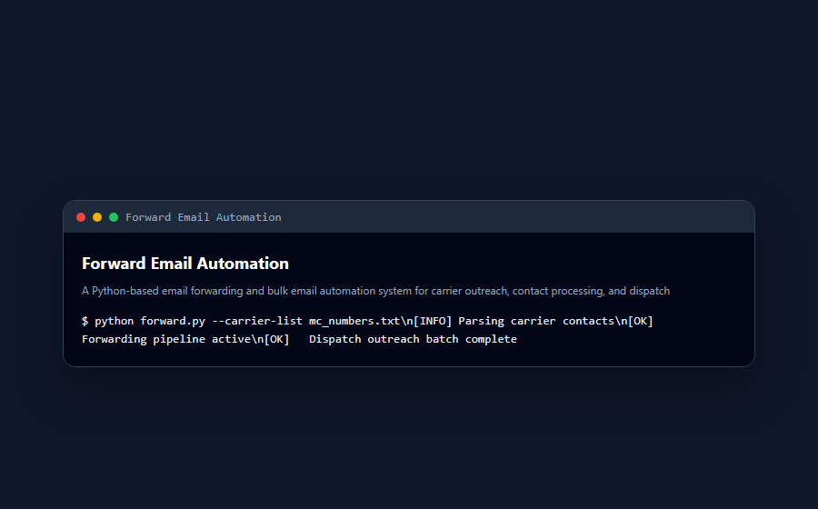

<div align="center">

# 🚀 Forward Email Automation

**A Python-based email forwarding and bulk email automation system for carrier outreach, contact processing, and dispatch communication workflows.**

Documented · MIT licensed · Maintained


[](LICENSE)
[](CONTRIBUTING.md)

</div>

---

## 🐍 Contribution graph

<picture>
  <source media="(prefers-color-scheme: dark)" srcset="https://raw.githubusercontent.com/mafzalkalwardev/forward-email-automation/output/snake-dark.svg" />
  <source media="(prefers-color-scheme: light)" srcset="https://raw.githubusercontent.com/mafzalkalwardev/forward-email-automation/output/snake.svg" />
  
</picture>

---

\# Forward Email Automation

A Python-based bulk email forwarding and automation system designed for carrier outreach, dispatch communication, and automated email workflows.

The project processes carrier data files and automates email communication tasks for dispatch and logistics operations.

\## Screenshots

## Screenshots



## Features

\- Bulk email automation

\- Carrier contact processing

\- Excel and CSV handling

\- Automated email workflows

\- Dispatch communication support

\- Large dataset processing

\- Email forwarding system

\- Automation utilities

\## Tech Stack

\- Python

\- Pandas

\- Jupyter Notebook

\- Excel Processing

\- CSV Processing

\- Email Automation

\## Project Structure

```text

forward-email-automation/

│

├── Email\_Sender.ipynb

├── carrier\_details.xlsx

├── README.md

└── .gitignore

```

\## Installation

Install required packages:

```bash

pip install pandas openpyxl

```

\## How to Run

Open Jupyter Notebook:

```bash

jupyter notebook

```

Then run:

```text

Email\_Sender.ipynb

```

\## Features Overview

\### Carrier Data Processing

Processes large carrier datasets from Excel and CSV files.

\### Email Automation

Automates bulk communication workflows.

\### Dispatch Workflow Support

Useful for logistics and dispatch operations.

\## Security Note

Do not upload:

\- private carrier data

\- personal emails

\- confidential dispatch records

\## Author

Muhammad Afzal Kalwar

GitHub:

@mafzalkalwardev
